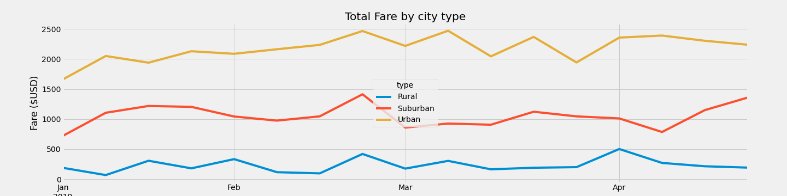

# PyBer_Analysis
## Project overview
This new analysis we will be looking more specifically into PyBer's first quarter for the 2019 year. The purpose of this analysis is to track different types of cities' fares every week, for the first quarter of the year.
## Results
Results for the first quarter are shown on the graph below

From the analysis we can see that:
- Rural cities have the least amount of drivers, rides and the most expensive fares; and therfore the most profit fare per ride ratio.
- Urban cities have the most drivers, and rides but the cheapest fares; and therefore the least profit fare per ride ratio.
- Suburban cities have a medium size pool of drivers, rides and fares compared to rural and urban cities.
## Summary
Suburban cities fall in between urban cities and rural cities in all aspects. 
Urban cities have the least profit per ride ratio, however they have the most rides. Rural cities, have the least amount of rides and the most expensive fares.
1. First recomendation is to try to keep urban cities' fares unchanged.
2. Second recomandation is to lower slightly urban cities' fares.
3. Third recomandation is to lower geatly rural cities' fares.
These recomandations should help increase rides for rural cities.
